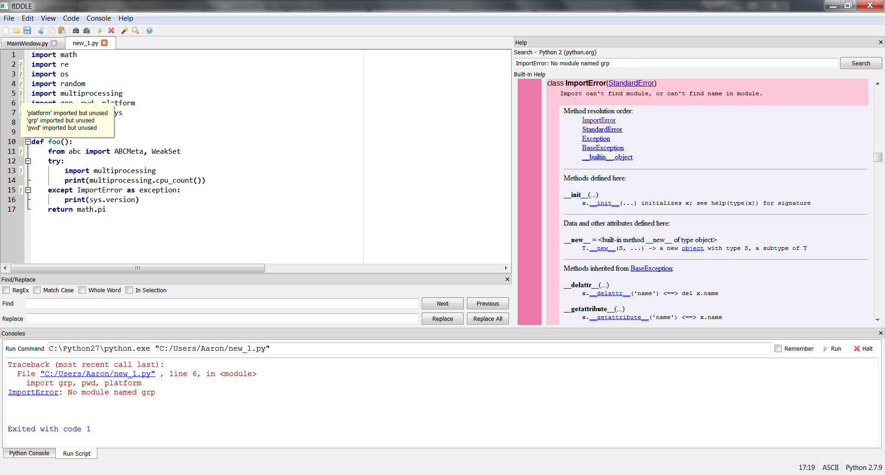

# fIDDLE
```python
from __future__ import idle
```

fIDDLE is a Python code editor designed as an alternate to Python's default IDLE development environment. It is aimed
at beginning Python programmers and experience Python developers that may not require a full blown IDE for simpler
projects.

fIDDLE has been inspired by the [IDLE Reimagined](https://github.com/asweigart/idle-reimagined) project.



## Features
 - Interacitve interpreter (Python shell)
 - Tabbed file editor with code completion
 - Easy access to built-in Python documentation (via pydoc)
 - Quick search for errors
 - Improved tracback information
 - One touch code cleaner and code checker
 - Easily switch between interpreters (including virtual environments)

## Requirements
 - [Python 3.4](https://www.python.org/downloads/)
 - [PyQt4](https://www.riverbankcomputing.com/software/pyqt/download)
 - [chardet](https://pypi.python.org/pypi/chardet) - to guess file encodings
 - [autopep8](https://pypi.python.org/pypi/autopep8) - to clean Python files formatting
 - [pyflakes](https://pypi.python.org/pypi/pyflakes) - to check Python files for errors

## Status
fIDDLE is currently in beta development so features may be removed or changed.

## License
fIDDLE is released under the MIT License, see [LICENSE](./LICENSE) for more information.

Copyright (c) 2015 Aaron Kehrer
