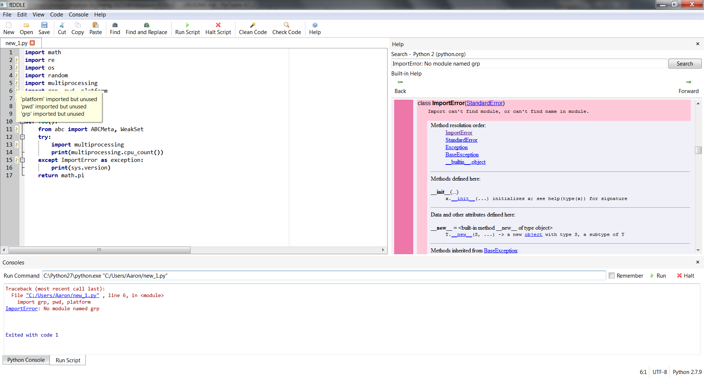

# 

```python
from __future__ import idle
```

fiddle is a Python code editor designed as an alternate to Python's default IDLE development environment. It is aimed
at both beginning Python programmers just learning the language and experience Python developers that may not require a
full IDE for simpler projects.

fiddle has been inspired by the [IDLE Reimagined](https://github.com/asweigart/idle-reimagined) project.



## Features
 - Interactive interpreter (Python shell)
 - Tabbed file editor with code completion
 - Easy access to built-in Python documentation (via pydoc)
 - Quick search for errors
 - Improved traceback information
 - One touch code cleaner and code checker
 - Easily switch between interpreters (including virtual environments)

## Status
fiddle is currently in beta development so features may be removed or changed and things will be rough around the
edges.

## Installation
There are Windows builds available for each [release](https://github.com/akehrer/fiddle/releases) in a ZIP
archive. These were built use [cx_Freeze](http://cx-freeze.sourceforge.net/).

If you want to run the source directly, installation instructions for the three major systems are available
[here](https://github.com/akehrer/fiddle/wiki/Installation).

## Requirements
 - [Python 3.4](https://www.python.org/downloads/)
 - [PyQt4](https://www.riverbankcomputing.com/software/pyqt/download)
 - [chardet](https://pypi.python.org/pypi/chardet) - to guess file encodings
 - [autopep8](https://pypi.python.org/pypi/autopep8) - to clean Python files formatting
 - [pyflakes](https://pypi.python.org/pypi/pyflakes) - to check Python files for errors

## Contribute
Contirbutions to the development of fiddle are welcome from anyone. Here are a few ways to help out:

  - There is an open mailing list at [fiddle-discuss](https://groups.google.com/forum/#!forum/fiddle-discuss) where we talk about all things related to fiddle.
  - If you have found a bug please submit an [issue](https://github.com/akehrer/fiddle/issues)
  - If you would like to contribute code please base your feature branch off of `master` and make sure all tests pass before submitting a pull request


## License
fiddle is released under the MIT License, see [LICENSE](./LICENSE) for more information.

Copyright (c) 2015 Aaron Kehrer
