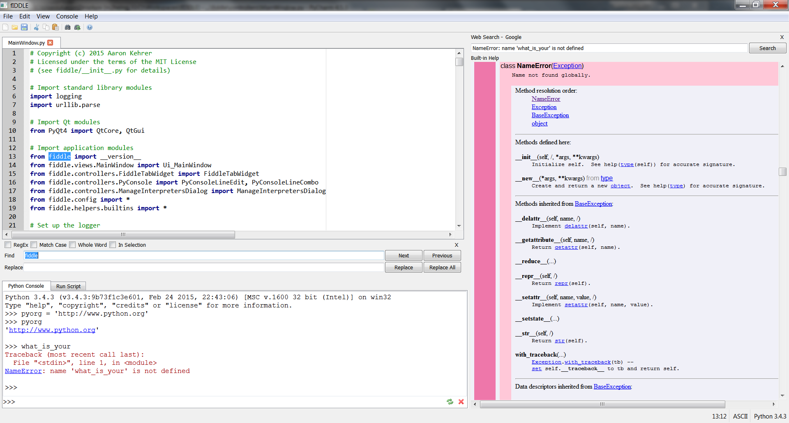

# fIDDLE
A Python code editor aimed at new programmers as an alternate to IDLE. Inspired by the
[IDLE Reimagined](https://github.com/asweigart/idle-reimagined) project.

## Requirements
 - Python 3.4
 - PyQt4
 - chardet - to guess file encodings
 - autopep8 - to clean Python files

## License
Released under the MIT License

Copyright (c) 2015 Aaron Kehrer
